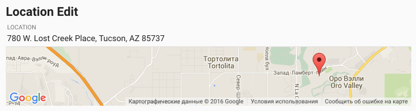
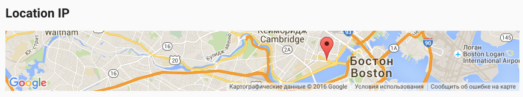
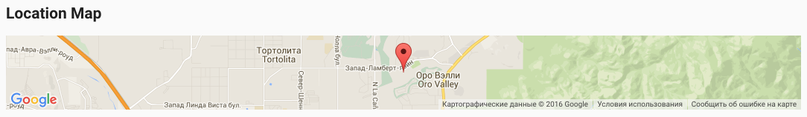
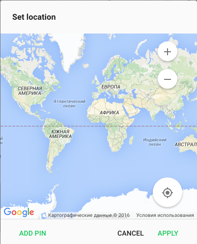

# Pip.WebUI Location Controls

Location Control UI components is a sub-module of Pip.Services platform and can be used in applications
based on the platform.

This module provides next functionality:

* Location view control
* Location edit control
* Location IP control
* Location map control
* Location dialog

The controls are reproduced components to showing position on the world map. This one is based on Google Maps API.

In the version 1.0.0 the implementation was cleaned up and covered with unit tests.
Implementation became fully portable across browser and devices.


### The complete library

 * [https://github.com/pip-webui/pip-webui](https://github.com/pip-webui/pip-webui)

## Demos

[Examples Online](http://webui.pipdevs.com/pip-webui-locations/index.html)


## Quick links

* [Module dependencies](#dependencies)
* [Components](#components)
  - [Location view control](#location_view)
  - [Location edit control](#location_edit)
  - [Location IP control](#location_ip)
  - [Location map control](#location_map)
  - [Location dialog](#location_dialog)
* [Browsers compatibility](#compatibility)
* [Community](#community)
* [Contributing](#contributing)
* [Build](#build)
* [License](#license)


## <a name="dependencies"></a>Module dependencies

* <a href="https://github.com/pip-webui/pip-webui-lib">pip-webui-lib</a> - Vendor libraries
* <a href="https://github.com/pip-webui/pip-webui-css">pip-webui-css</a> - CSS Framework
* <a href="https://github.com/pip-webui/pip-webui-core">pip-webui-core</a> - Core platform module
* <a href="https://github.com/pip-webui/pip-webui-layouts">pip-webui-layouts</a> - Document layouts
* <a href="https://github.com/pip-webui/pip-webui-tasks">pip-webui-tasks</a> - Helpful tasks for development

## <a name="components"></a>Module components

### <a name="location_view"></a>Location view control
<a href="doc/images/img-location-view.png" style="border: 3px ridge #c8d2df;margin: auto; display: inline-block">
    
</a>

It provides a UI component to perform position of a user on the map. This component doesn't mean to edit location.

[Online Example](http://webui.pipdevs.com/pip-webui-locations/index.html#/location)

<br/>

### <a name="location_edit"></a>Location edit control
<a href="doc/images/img-location-edit-view.png" style="border: 3px ridge #c8d2df; margin: auto; display: inline-block">
    
</a>

This component has the same functionality like a previous component and provides an input field to type necessary location name.
Typed locatino will be performed on the map component.


[Online Example](http://webui.pipdevs.com/pip-webui-locations/index.html#/location)

<br/>


### <a name="location_ip"></a>Location IP control
<a href="doc/images/img-location-ip.png" style="border: 3px ridge #c8d2df; margin: auto; display: inline-block">
    
</a>

This components renders location of user by passed IP via attribute `pip-ipaddress`.

[Online Example](http://webui.pipdevs.com/pip-webui-locations/index.html#/location)

<br/>

### <a name="location_map"></a>Location map control
<a href="doc/images/img-location-map.png" style="border: 3px ridge #c8d2df; margin: auto; display: inline-block">
    
</a>

This component performs location of user by passed geo coordinates (latitude and longitude).

[Online Example](http://webui.pipdevs.com/pip-webui-locations/index.html#/location)

<br/>

### <a name="location_dialog"></a>Location dialog
<a href="doc/images/img-location-dialog.png" style="border: 3px ridge #c8d2df; width: 50%; margin: auto; display: block">
    
</a>

This panel performed some controls to help user establish his/her location on the map. User can zoom map to view more
detailed map. Also there is a button to detect user's location automatically. If it can't detect user's location correct
user can establish pin on the map manually.


[Online Example](http://webui.pipdevs.com/pip-webui-locations/index.html#/location)


## <a name="compatibility"></a>Compatibility

PIP.WEBUI has been thoroughly tested against all major browsers and supports:

 * IE11+,
 * Edge
 * Chrome 47+,
 * Firefox 43
 * Opera 35

## <a name="community"></a>Community

* Follow [@pip.webui on Twitter](http://link.com)
* Subscribe to the [PIP.WebUI Newsletter](http://link.com)
* Have a question that's not a feature request or bug report? Discuss on the [PIP Forum](https://groups.google.com/forum/#!forum/pipdevs)
* Have a feature request or find a bug? [Submit an issue](http://link.com)
* Join our Community Slack Group! [PIP Worldwide](http://link.com)


## <a name="contributing"></a>Contributing

Developers interested in contributing should read the following guidelines:

* [Issue Guidelines](http://somelink.com)
* [Contributing Guidelines](http://somelink.com)
* [Coding guidelines](http://somelink.com)

> Please do **not** ask general questions in an issue. Issues are only to report bugs, request
  enhancements, or request new features. For general questions and discussions, use the
  [Pip Devs Forum](https://groups.google.com/forum/#!forum/pipdevs).

It is important to note that for each release, the [ChangeLog](CHANGELOG.md) is a resource that will
itemize all:

- Bug Fixes
- New Features
- Breaking Changes

## <a name="build"></a>Build

Projects environment deploy is occurred using npm and gulp.

First install or update your local project's **npm** tools:

```bash
# First install all the NPM tools:
npm install

# Or update
npm update
```

Then run the **gulp** tasks:

```bash
# To clean '/build' and '/dist' directories
gulp clean

# To build distribution files in the `/dist` directory
gulp build

# To launch samples (build will open samples/index page in web browser)
gulp launch
```

For more details on how the build process works and additional commands (available for testing and
debugging) developers should read the [Build Instructions](docs/guides/BUILD.md).


## <a name="license"></a>License

PIP.WebUI is under [MIT licensed](LICENSE).

