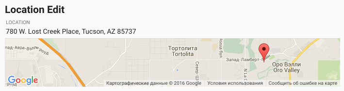

# Pip.WebUI.Locations User's Guide

## <a name="contents"></a> Contents
- [Installing](#install)
- [pip-location directive](#location)
- [pip-location-map directive](#location_map)
- [pip-location-ip directive](#location_ip)
- [pip-location-edit directive](#location_edit)
- [pipLocationDialog](#location_dialog)
- [Questions and bugs](#issues)


## <a name="install"></a> Installing

Add dependency to **pip-webui** into your **bower.json** or **package.json** file depending what you use.
```javascript
"dependencies": {
  ...
  "pip-webui": "*"
  ...
}
```

Alternatively you can install **pip-webui** manually using **bower**:
```bash
bower install pip-webui
```

or install it using **npm**:
```bash
npm install pip-webui
```

Include **pip-webui** files into your web application.
```html
<link rel="stylesheet" href=".../pip-webui-lib.min.css"/>
<link rel="stylesheet" href=".../pip-webui.min.css"/>
...
<script src=".../pip-webui-lib.min.js"></script>
<script src=".../pip-webui.min.js"></script>
```

Register **pipLocations** module in angular module dependencies.
```javascript
angular.module('myApp',[..., 'pipLocations']);
```


## <a name="location_map"></a> pip-location-map directive

**pip-location-map** is the most basic among all controls. It visualized a point on a small map that can be embedded into a view.

### Usage
```html
<pip-location-map pip-rebind="true"
                  pip-location-pos="position"
                  pip-location-positions="positions"
                  pip-draggable="true"
                  pip-stretch="true">
</pip-location-map>
```


### Attributes
* **pip-rebind** - means that map will be updated after changing position or positions. Possible values: **true** or **false**.
* **pip-location-pos** - coordinates of position, which create marker on map. Value: { type: 'point', coordinates: {33.444567, -110.54778} }
* **pip-location-positions** - coordinate array, which create several markers on map.
* **pip-draggable** - permission to drag map. Possible values: **true** or **false**.
* **pip-stretch** - map stretches the length and width of the parent block. Possible values: **true** or **false**.

## <a name="location"></a> pip-location directive

**pip-location** shows address or coordinates if address is not available followed by the map with the point.
The control can be set to make map collapsable to save some space on screen.

### Usage
```html
<pip-location pip-rebind="true"
              pip-show-location-icon="true" pip-collapse="true"
              pip-location-name="location_name" pip-location-pos="location">
</pip-location>
```

Todo: replace picture with correct screenshot

    
### Attributes
* **pip-rebind** - means that map will be updated after changing position. Possible values: **true** or **false**.
* **pip-location-pos** - coordinates of position, which create marker on map. Value: { type: 'point', coordinates: {33.444567, -110.54778} }
* **pip-collapse** - sets collapsed control or not. Possible values: **true** or **false**.
* **pip-show-location-icon** - sets the presence of icon. Possible values: **true** or **false**.
* **pip-location-name** - place name where the coordinates point

## <a name="location_ip"></a> pip-location-ip directive

**pip-location-ip** control may look exactly as **pip-location-view**. But instead of position it accepts IP address and uses Google location service to convert it into physical address. This control can be helpful to visualize location of servers or places there users signin into application.

### Usage
```html
<pip-location-ip pip-rebind="true"
                 pip-ipaddress="ipaddress">
</pip-location-ip>
```


### Attributes
* **pip-rebind** - means that map will be updated after changing ip-address. Possible values: **true** or **false**.
* **pip-ipaddress** - ip-address of location position.

## <a name="location_edit"></a> pip-location-edit directive

**pip-location-edit** allows to change the location address or coordinates. They can be entered manually or set via **pipLocationDialog**

### Usage
```html
<pip-location-edit ng-disabled="locationDisabled"
                   pip-location-name="location_name"
                   pip-location-holder="true"
                   pip-changed="positionChanged()"
                   pip-location-pos="location">
</pip-location-edit>
```


### Attributes
* **ng-disabled** - disabling of control. Possible values: **true** or **false**.
* **pip-location-pos** - coordinates of position, which create marker on map. Value: { type: 'point', coordinates: {33.444567, -110.54778} }
* **pip-location-name** - place name where the coordinates point.
* **pip-location-holder** - set the existence of 'md-no-float' attribute.
* **pip-changed** - it triggered after position change.

## <a name="location_dialog"></a> pipLocationDialog

**pipLocationEditDialog** allows to set location by manually picking a point on map, or using current location from the device.

### Usage
```javascript
$scope.location = {
    name: '780 W. Lost Creek Place, Tucson, AZ 85737',
    'type': 'Point',
    'coordinates': [32.393603, -110.98259300000001]
};


pipLocationEditDialog.show(
    {
        locationName: $scope.location.name,
        locationPos: $scope.location
    },
    function (result) {
        // Callback after dialog close
        console.log('Selected New Location');
        console.log(result);
        if (result)
            $scope.note.location_pos = result.locationPos;
    }
);
```


### Methods
Todo: finish this
* **show** - show dialog. Options:


## <a name="issues"></a> Questions and bugs

If you have any questions regarding the module, you can ask them using our 
[discussion forum](https://groups.google.com/forum/#!forum/pip-webui).

Bugs related to this module can be reported using [github issues](https://github.com/pip-webui/pip-webui-locations/issues).
